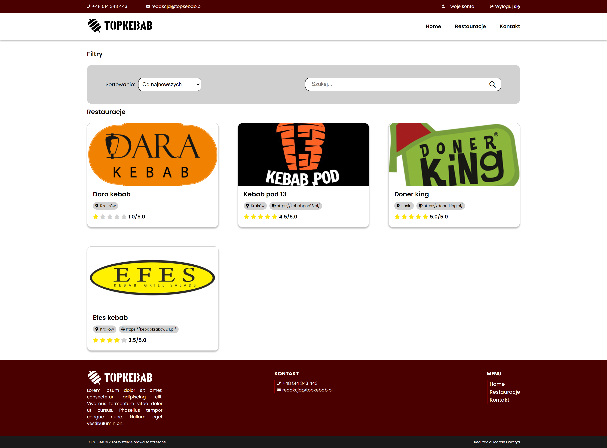

# Restaurant Rater Application

Restaurant Rater is an application that allows users to rate and review restaurants, supporting both regular users and administrators with different privileges. It features user registration and offers the ability to search and sort restaurant listings based on various criteria, enhancing user experience.

## Table of Contents
1. [Features](#features)
2. [Technologies](#technologies)
3. [Database Design and Structure](#database-design-and-structure)
4. [Design Patterns](#design-patterns)
5. [Installation](#installation)
6. [Screenshots](#screenshots)
7. [License](#license)

## Features

1. Both administrators and users can register and log into the system.
2. Role-Based Access Control:
   - Regular Users can rate restaurants on a scale of 1 to 5 and leave reviews.
   - Administrators have all user capabilities plus they can add, edit, delete, and publish restaurant listings.
3. Users can search for restaurants and sort the results based on various criteria.
4. Users can change their passwords after registering.

## Technologies

- HTML
- CSS
- JavaScript
- PHP
- NGINX
- PostgreSQL
- Docker

The entire application is designed to be fully responsive, ensuring a seamless user experience on both desktop and mobile devices.

## Database Design and Structure

The application utilizes a PostgreSQL database with tables designed for users, roles, restaurants, reviews, and log activities. Key features include:
- `is_user`: Stores user data and role relationships.
- `is_role`: Defines user roles.
- `is_restaurant`: Stores restaurant details linked to addresses and includes publication status.
- `is_review`: Contains user reviews for restaurants, including ratings and review text.
- `is_log`: Logs changes to restaurant data.
- Use of triggers to automatically log database actions.


## Design Patterns

This project is implemented using the Model-View-Controller (MVC) architecture:
- **Models** provide the methods and logic to interact directly with the database.
- **Controllers** handle the business logic and respond to user input.
- **Views** are responsible for rendering the user interface.

## Installation

To install and run the project, follow these steps:
1. Ensure Docker is installed on your machine.
2. Clone the repository and navigate to the project directory.
3. Use Docker Compose to build and start the services:
    ```bash
   docker-compose up --build
    ```
4. Import the database schema and data from the provided SQL dump into your PostgreSQL instance.
5. Modify the Config.php to suit your environment settings, specifically for database connections.
    ```php
       'db' => [
        'host' => '',
        'username' => '',
        'password' => '',
        'database' => '',
        'port' => ''
    ]
    ```

## Screenshots
Below are screenshots from various parts of the Restaurant Rater application, showcasing the interface for desktop and mobile devices:





## License

This project is licensed under the [MIT License](LICENSE.md) - see the file for details.
